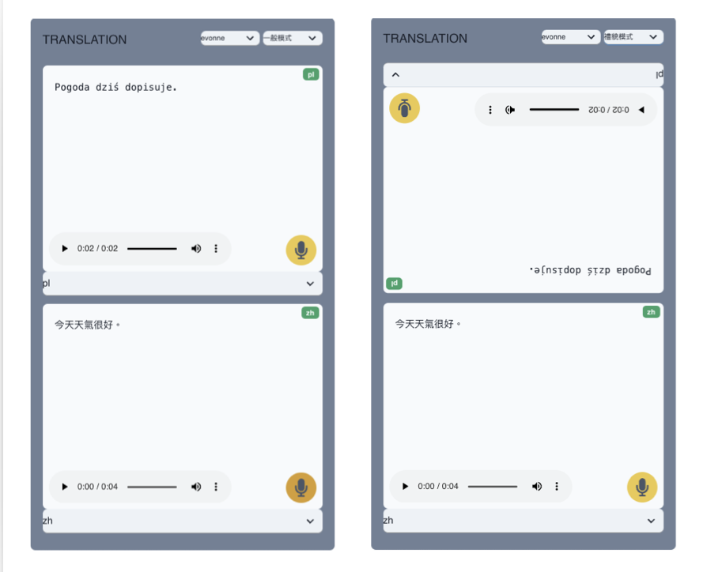
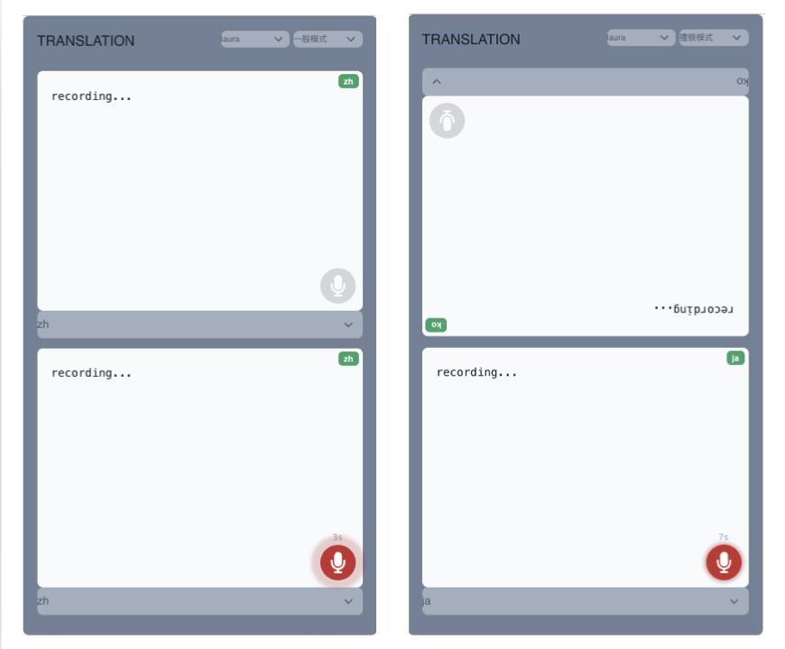

# Translations - Multiple Languages

> 一款針對多國語言即時對話的應用工具，特別適合於外國人之間的對話交流。通過兩個對話視窗，使用者可以輕鬆進行語音錄製和語音辨識，並根據辨識結果選擇不同的聲音模型播放。

## 📷 Screenshot

## ✨ Features

1. 多國語言辨識：使用者可以在任一對話視窗中選擇所需的辨識語言。
2. 聲音模型選擇：使用者可以依據後端提供的參數選擇不同的聲音模型，音檔辨識結果會根據選擇有所不同。
3. 錄音與上傳：使用者可以在任一對話視窗中錄製聲音並上傳音檔至系統服務。如果在對話視窗 A 錄製，結果將顯示在對話視窗 B；如果在對話視窗 B 錄製，結果將顯示在對話視窗 A。
4. 語音辨識與顯示：系統會辨識上傳的音檔並將轉換後的文字顯示於相對應的對話視窗中。
5. 音檔播放：使用者可以播放辨識後的音檔，方便確認內容。
6. 介面：使用者可以調整視覺模式分成：一般及禮貌

## 🤖 Prerequisites

- Node.js (v18.18.0 or later)
- pnpm
- docker(options)

## 🔨 Installation

### Method 1

1. Run `pnpm install`
2. Create a `.env` file at the root directory of the project and add the necessary environment variables. See the .env.sample file for reference.
3. Run `pnpm run dev`

### Method 2

1. docker compose up -d

## 🔗 Tech Stack

Technologies used in this project

- React
- React Query
- TypeScript
- Zustand
- Axios
- Vitest + React
- Chakra UI
